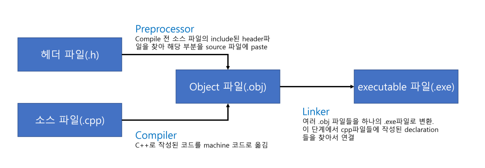
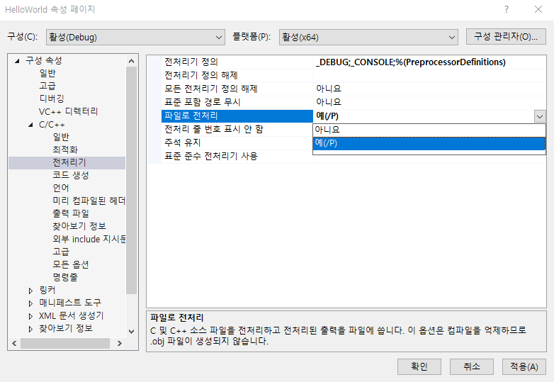

# Hello Word

### C++의 동작과정




### 코드 예시

```c++
// Main.cpp
#include <iostream>
// preprocessor satement: compile 전에 진행해서 preprocessor라고 불림
// compiler가 source 파일을 받을 때 가장 먼저 # 부분을 처리
// #include 뒤에 나오는 파일명을 찾아 현재 #include가 있는 자리에 paste해줌
// 이때 참조되는 파일이 header 파일
void Log(const char*);
// 다른 파일에 있는 함수라도 declaration만 해주면
// linker가 .obj 파일들을 .exe로 통합하는 과정에서 연결해준다.
int main()
{
    std::cout << "Hello World!" << std::endl;
    
    std::cin.get();
    
    return 0; 
    //  main function은 값을 명시하지 않아도 됨
    // 명시하지 않은 경우 return 값을 0으로 간주
}
```

```c++
// Log.cpp
#include <iostream>

void Log(const char* message)
{
	std::cout << message << std::endl;
}
```


### Compiler

- compiler: `.cpp` 텍스트 파일을 `.obj` 파일로 변환(c++ >> machine code)

- 결과적으로 사람이 작성한 코드를 `cpu`가 실행시킬 `constant data`와 `instruction`로 변환

- JAVA의 compiling와 다르게 C++는 `.cpp`, `.h`라는 파일 확장자명을 통해 compiler가 쉽게 소스코드와 헤더파일을 알아서 compile

- compiler를 통해 나온 `.obj`파일을 열어보면 아래와 같은 binary machine code를 볼 수 있다.

  ```objc
  //Math.i
  6486 0d00 f0c0 3162 db06 0000 3500 0000
  0000 0000 2e64 7265 6374 7665 0000 0000
  0000 0000 8200 0000 1c02 0000 0000 0000
  0000 0000 0000 0000 000a 1000 2e64 6562
  7567 2453 0000 0000 0000 0000 3401 0000
  9e02 0000 d203 0000 0000 0000 0200 0000
  4000 1042 2e6d 7376 636a 6d63 0000 0000
  0000 0000 0100 0000 e603 0000 0000 0000
  0000 0000 0000 0000 4000 10c0 2e74 6578
  7424 6d6e 0000 0000 0000 0000 3f00 0000
  e703 0000 2604 0000 0000 0000 0200 0000
  2010 5060 2e64 6562 7567 2453 0000 0000
  0000 0000 dc00 0000 3a04 0000 1605 0000
  0000 0000 0400 0000 4010 1042 2e74 6578
  7424 6d6e 0000 0000 0000 0000 0300 0000
  3e05 0000 0000 0000 0000 0000 0000 0000
  2010 5060 2e64 6562 7567 2453 0000 0000
  0000 0000 6c00 0000 4105 0000 ad05 0000
  0000 0000 0200 0000 4010 1042 2e78 6461
  ```

- 참고로 실제 cpu가 연산하게 될 명령어는 아래와 같다.

  ```assembly
  # Math.asm
  include listing.inc
  
  INCLUDELIB MSVCRTD
  INCLUDELIB OLDNAMES
  
  msvcjmc	SEGMENT
  __E2BA8354_Math@cpp DB 01H
  msvcjmc	ENDS
  PUBLIC	?Multiply@@YAHHH@Z				; Multiply
  PUBLIC	__JustMyCode_Default
  EXTRN	_RTC_InitBase:PROC
  EXTRN	_RTC_Shutdown:PROC
  EXTRN	__CheckForDebuggerJustMyCode:PROC
  ;	COMDAT pdata
  pdata	SEGMENT
  $pdata$?Multiply@@YAHHH@Z DD imagerel $LN3
  	DD	imagerel $LN3+63
  	DD	imagerel $unwind$?Multiply@@YAHHH@Z
  pdata	ENDS
  ;	COMDAT rtc$TMZ
  rtc$TMZ	SEGMENT
  _RTC_Shutdown.rtc$TMZ DQ FLAT:_RTC_Shutdown
  rtc$TMZ	ENDS
  ;	COMDAT rtc$IMZ
  rtc$IMZ	SEGMENT
  _RTC_InitBase.rtc$IMZ DQ FLAT:_RTC_InitBase
  rtc$IMZ	ENDS
  ;	COMDAT xdata
  xdata	SEGMENT
  $unwind$?Multiply@@YAHHH@Z DD 025051601H
  	DD	01112316H
  	DD	0700a0021H
  	DD	05009H
  xdata	ENDS
  ; Function compile flags: /Odt
  ;	COMDAT __JustMyCode_Default
  _TEXT	SEGMENT
  __JustMyCode_Default PROC				; COMDAT
  	ret	0
  __JustMyCode_Default ENDP
  _TEXT	ENDS
  ; Function compile flags: /Odtp /RTCsu /ZI
  ;	COMDAT ?Multiply@@YAHHH@Z
  _TEXT	SEGMENT
  result$ = 4
  a$ = 256
  b$ = 264
  ?Multiply@@YAHHH@Z PROC					; Multiply, COMDAT
  ; File C:\github\CPP\HelloWorld\HelloWorld\Math.cpp
  ; Line 2
  $LN3:
  	mov	DWORD PTR [rsp+16], edx
  	mov	DWORD PTR [rsp+8], ecx
  	push	rbp
  	push	rdi
  	sub	rsp, 264				; 00000108H
  	lea	rbp, QWORD PTR [rsp+32]
  	lea	rcx, OFFSET FLAT:__E2BA8354_Math@cpp
  	call	__CheckForDebuggerJustMyCode
  ; Line 3
  	mov	eax, DWORD PTR a$[rbp]
  	imul	eax, DWORD PTR b$[rbp]
  	mov	DWORD PTR result$[rbp], eax
  ; Line 5
  	mov	eax, DWORD PTR result$[rbp]
  ; Line 6
  	lea	rsp, QWORD PTR [rbp+232]
  	pop	rdi
  	pop	rbp
  	ret	0
  ?Multiply@@YAHHH@Z ENDP					; Multiply
  _TEXT	ENDS
  END
  ```

  이렇게 긴 assemblier 코드는 optimization, runtime 설정 등을 통해 그 길이가 달라질 수 있다.

### Preprocessor

- `#include` 구문에서 해당 header 파일을 찾아서 소스파일에 paste해준다

**example**

```c++
// EndBrace.h
}
```

```C++
// Math.cpp
int Multiply(int a, int b)
{
    int result = a*b;
    
    return result;
    #include "EndBrace.h"
```

위와 같이 Math.cpp의 Multiply함수에서 `}`를 생략하더라도 #include 구문을 통해 `EndBrace.h`의 `}`를 

> Visual Studio의 설정에서 preprocess 과정을 확인해 볼 수 있다.
>
> 
>
> 솔루션의 속성에 들어가서 `파일로 전처리(preprocess to files)`를 `예`로 바꿔주면 debug 폴더에 전처리 과정이 담긴 파일이 output으로 나온다.

실제 전처리 과정을 보면 다음과 같다.

```c++
#line 1 "\\CPP\\HelloWorld\\HelloWorld\\Math.cpp"
int Multiply(int a, int b)
{
	int result = a * b;

	return result;
	#line 1 "\\CPP\\HelloWorld\\HelloWorld\\EndBrace.h"
}
#line 7 "\\CPP\\HelloWorld\\HelloWorld\\Math.cpp"
```

말그대로 `#include "EndBrace.h"`자리에 해당 파일을 `paste`해버리는 것을 볼 수 있다.

- `#include `외에도 `#define`, `#if` 도 마찬가지이다.
- 우리가 흔히 쓰는 `#include <iostream>`은 실제로 약 50,600줄에 달하는 코드를 `.cpp`파일에 붙여넣는 명령어이다. 그렇기에, 해당 구문을 사용하면 몇 줄 안되는 코드도 용량이 30kb가 넘어버린다.


### Linker

서로 다른 obj 파일에 분산되어 있는 함수들을 이어주는 역할
