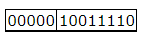
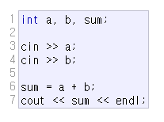

# Compiler

### What is a compiler?

- `machine code`: binary digit으로 구성된 언어로 실제 컴퓨터가 실행하는 코드

  

- 이러한 machine code는 작성 과정이 매우 지루하며 error가 발생할 소지가 다분하다.
- 이러한 `low level` 언어를 대신하기 위해 프로그래머가 확인하고 이해하기 쉬운 `high level`언어가 만들어졌다. 그 중 하나가 `C/C++`

- 위의 코드를 완전히 이해할 수 없더라도 앞서 보여준 machine code에 비해 매우 쉽다는 것을 알 수 있다.
- `low level`언어와 `high level`언어의 간극을 이어주기 위해 사용하는 것이 바로 `compiler`, `interpreter` 혹은 `assembler`와 같은 도구들이다.

- `C++`은 `compiler`를 사용하는 언어로 우리가 작성한 코드를 시스템에 의해 바로 해석되는 machine code로 번역된다. 이러한 과정은 산출된 프로그램의 성능을 효율적으로 만든다. 
- 이를 위해, `compiler`와 `linker`라는 핵심 도구들이 필요하다.

### Console programs

- `console program`: text를 이용하여 사용자 혹은 입/출력 환경과 소통하는 프로그램
- console program은 프로그래머가 다루기 쉽고, 일반적으로 모든 플랫폼에서 동일하기 때문에 예측 가능성이 높다.

- console program을 컴파일하는 방법은 운영체제/ IDE/ Compiler의 종류에 따라 달라진다.

### reference

[CPP_Tutroials_Compiler](https://www.cplusplus.com/doc/tutorial/introduction/)