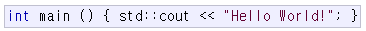
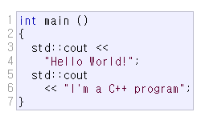

# Structure of a Program

### structure of a program

```cpp
//my first program in c++
#include <iostream>

int main() {
    std::cout << "Hello World!";
}
```


##### Line1: `// my first program in C++`

`//`: 주석처리, 실제로 program에 아무런 영향을 주지 않으며 짧은 설명이나 code 실행 시의 관측 내용을 작성해두는 부분이다.


##### Line2: `#include <iostream>`

`#`: `preprocessor`가 compile이 시작되기 전에  읽고 처리하는 부분. 예시에서는 c++표준 코드의 `<iostream> header`를  해당 부분에 가져오게 된다.


##### Line3: A blank line

코드의 가독성을 위해 존재하는 부분. 실제로 프로그램에는 아무런 영향을 주지 않는다.


##### Line4: `int main()`

main 함수를 정의하는 부분. 이 main 함수는 `C++`에서 프로그램이 시작할 때 부르는 함수이다(start point). 어떠한 파일에 작성되어 있는지와는 상관없이  모든`C++` 프로그램은 main함수에 의해 시작된다.


##### Line5&7: `{` and `}`

`{`와 `}`는 각각 함수의 시작과 끝을 의미한다. `{`와 `}` 의 사이 코드를 함수의 `body`라고 한다.


##### Line6: `std::cout  << "Hello World!";`

`std`: <u>st</u>andar<u>d</u> (표준)

`cout`: <u>c</u>haracter <u>out</u>put (문자 출력)

`<<`: insert operator

`;`: 한 줄의 코드를 마칠 때 사용. 모든 C++의 코드들은 `;`으로 끝나야 한다. (안그러면 compile 에러 발생)


- `C++`에서 `indentation`은 프로그램에 아무런 영향을 주지 않는다. 그저 사람이 알아보기 편하기 위해 사용한다.

  

- `line seperation` 역시 프로그램에 아무런 영향을 주지 않는다. `;`만 잘 작성해주면 된다.

  

- compile 단계에서 처리되지 않기에 `preprocessor`는 이러한 규칙들이 적용되지 않는다. `#`구문은 반드시 하나의 줄 안에서 처리되어야 하며, `;`이 붙지 않아도 된다.


### Comments

- `line comment`

  ```cpp
  // this is line comment
  ```

- `block comment`

  ```cpp
  /*
  	this
  	is
  	block
  	comment
  */
  ```


### Using namespace

`std`라는 namespace에 있는 요소를 참조하기 위해서는 해당 요소를 사용하는 부분에서 일일히 `std`라고 `qualify`해주어야 한다. 이러한 번거로움을 없애기 위해 `using`선언을 통해 namespace를 미리 지정해준다. (자세한 설명은 나중에 visibility 파트에서!)

```cpp
using namespace std;
```


### Reference

- [CPP_Tutorials_Program_Structure](https://www.cplusplus.com/doc/tutorial/program_structure/)